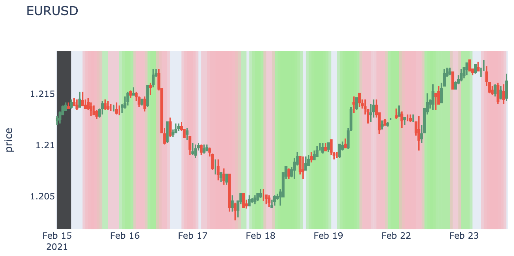

# project3-cnn
- UWA Boot Camp Data Analytics
- Project 3 - Convolutional Neural Network
- [Anthony van der Wal](https://anthonyvanderwal.github.io/my-first.html) - 27 February 2021.
  

---
### Presentation
- [pptx](./2021-02-27--anthonyvanderwal-project3-presentation-time-series-classification-with-cnn.pptx)
- [pdf](./2021-02-27--anthonyvanderwal-project3-presentation-time-series-classification-with-cnn.pdf)

---
### Screenshot
<kbd></kbd>

